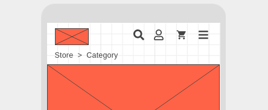
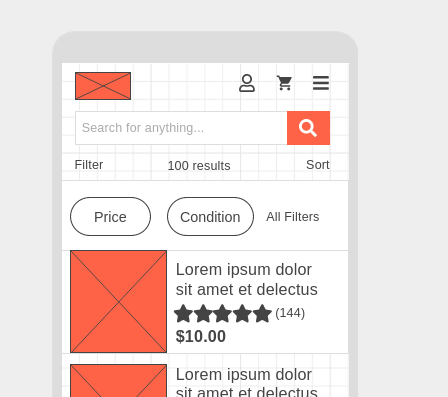

<h1 align="center">TODO's</h1>

## Header

Apperance changes based on layout property

### Home & Category

At home, our header does not show a search button and instead shows a search bar below its

- No search button icon on header
- Search bar appears under the header

### Single Product

On product pages we do not show the search bar by default and instead show a button at the top

- Search button in header
- Search bar is hidden and appears when clicked (tapped)

---

## Search

Search bar when in focus fills in the entire screen with a white background.

- Wrapper takes up entire screen (white background)
- Show just bar, clear button and exit
- Put recent searches under search bar (**maybe**)

---

## Category

Similar to home, the search button is hidden the bar is visible under header.

- Search bar under header
- Results, Filter and sort buttons
- "Common filter buttons" under results & controls ^^^
- List of products
